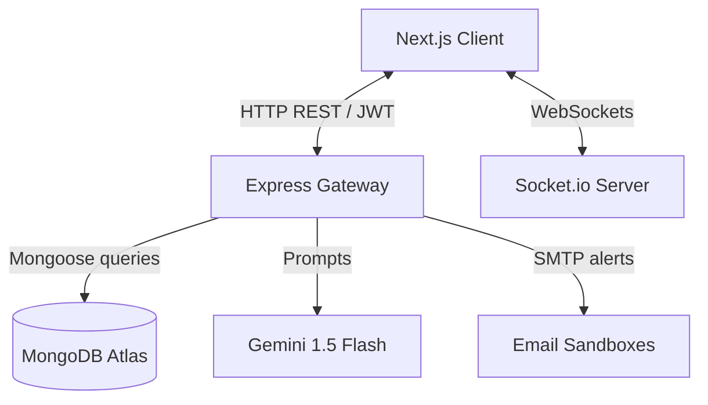

# RentMate AI - System Design Document

This document outlines the system architecture, database design, communication protocols, and AI pipelines for RentMate AI.

---

## 1. System Architecture

RentMate AI is designed around a decoupled, client-server monorepo architecture:

- **Frontend (Client)**: Next.js 15 App Router using React 19, Styled with Vanilla CSS (utility layers) and animated using Framer Motion. Uses React Contexts (`AuthContext`, `SocketContext`, `ThemeContext`) to manage global states.
- **Backend (Server)**: Express.js REST API with Socket.io server running in a single Node.js runtime process.
- **Database**: MongoDB Atlas for document storage and indexes.

---

## 2. Database Design

We implement six main database collections in MongoDB Atlas, with custom indices to optimize search and matching lookups:

1. **`Users`**: Holds credentials, role classifications (`tenant`, `owner`, `admin`), active states, and verification OTPs. (Index: `email: 1`, `role: 1`).
2. **`TenantProfiles`**: Stores search preferences (Preferred Location, Budget Range, Move-in Date, Lifestyle traits) referencing the user. (Unique Index: `userId: 1`; Indices: `budgetMax: 1`, `preferredLocation: 1`).
3. **`Listings`**: Holds landlord properties. (Indices: `ownerId: 1`, `rent: 1`, `location: 1`, `isFilled: 1`).
4. **`InterestRequests`**: Represents applications from tenants. (Compound Unique Index: `tenantId: 1, listingId: 1` to prevent duplicate submissions).
5. **`CompatibilityScores`**: Caches pre-calculated match scores and explanations. (Compound Unique Index: `tenantId: 1, listingId: 1`).
6. **`Messages`**: Stores real-time chat histories. (Index: `chatId: 1`).

---

## 3. AI Compatibility Engine & Fallback Logic

To compute matching scores between a Tenant Profile and Room Listing:

- **Cache Check**: The system queries `CompatibilityScores` first to see if a match score is already cached for the tenant and listing. If found, it returns instantly without redundant LLM calculations.
- **LLM Pipeline**: If cache misses, the server queries the Gemini 1.5 Flash API with a structured prompt, injecting the tenant's preferences (budget limit, location, room configuration, hobbies) and listing specs (rent, location, configurations, rules). The model responds in clean JSON containing a `score` (0-100), `explanation`, and `breakdown` items.
- **Automated Fallback**: If the Gemini API key is missing or encounters a timeout/quota limit, the server automatically boots a **Rule-Based Compatibility Matcher**. It awards up to 100 points based on budget fits (deducting proportional points if rent exceeds budget), location string matches, room type configurations, and gender rules. It returns a formatted explanation paragraph, ensuring no runtime errors are surfaced.

---

## 4. WebSocket Design

Real-time interactions are powered by Socket.io:
- **Authorization Gate**: To preserve safety, chat channels are initialized **only after** a landlord clicks **Accept** on an incoming interest application. Message dispatching in the socket gateway checks for this active relationship inside the `Chats` collection; otherwise, emissions are blocked.
- **Typing Indicators**: Emitted dynamically with a 2-second timeout window.
- **Seen Status (Read Receipts)**: Emitted when a client loads a conversation log or receives an active message. The server updates the message's `readBy` array in the database and broadcasts a seen sync event to update the sender's UI.

---

## 5. Notification Flow

The notification engine triggers two pipelines:
1. **In-App Alerts**: Stored in the `Notifications` collection, rendered in the header dropdown.
2. **Email Alerts (Nodemailer)**: 
   - **High Compatibility Alert**: Emailed to listing Owner if a tenant with score `> 80` applies.
   - **Application Updates**: Emailed to Tenant when landlord accepts or declines.
   - **Ethereal Mail Fallback**: If SMTP variables are missing, the system registers a sandbox account, logs dynamic web inspection links, and proceeds without throwing runtime failures.

---

## 6. Scalability

- **Database Cache**: Caching scores in `CompatibilityScores` limits expensive LLM API payloads to a single execution per match context.
- **Indices**: Query lookups (`isFilled: false`) and compound unique indices prevent write duplication and search bottlenecks as collection sizes expand.
